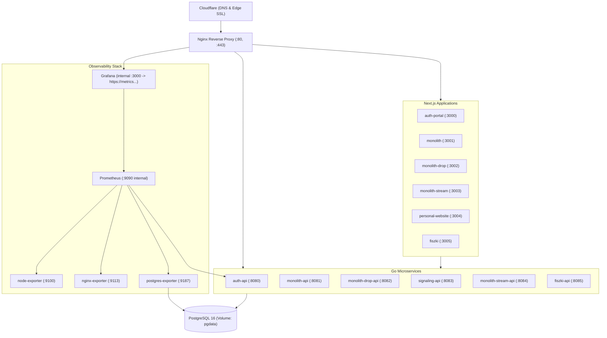

# Operations Runbook

This document covers daily maintenance and incident response procedures for the Swiss production stack.

---

## 1. System Architecture



---

## 2. Daily Operations

### Deploying Changes
- **Via GitHub Actions:** Go to **Actions** → **Deploy to production** → Click **Run workflow**.
- **Via SSH on the VPS:**
  ```bash
  cd ~/swiss
  ./scripts/deploy/deploy.sh
  ```

### Checking Status & Health
```bash
# Check running containers
docker compose -f deploy/docker-compose.prod.yml ps

# Run endpoint healthcheck
./scripts/deploy/healthcheck.sh
```

### Viewing Logs
```bash
# Follow Nginx proxy logs
./scripts/deploy/logs.sh

# Follow all app logs
docker compose -f deploy/docker-compose.prod.yml logs -f --tail=100

# Follow a specific service (e.g. auth-api)
docker compose -f deploy/docker-compose.prod.yml logs -f auth-api
```

### Restarting Services
```bash
# Restart everything
./scripts/deploy/restart.sh

# Restart a single service without downtime for others
docker compose -f deploy/docker-compose.prod.yml restart auth-api
```

### Freeing Disk Space
```bash
# Stop containers, remove unused images and build cache (keeps database safe)
./scripts/deploy/down.sh
docker system prune -a -f
docker builder prune -a -f
./scripts/deploy/deploy.sh
```

---

## 3. Incident Response

### Problem: 502 Bad Gateway
1. **Check which container is down:**
   ```bash
   docker compose -f deploy/docker-compose.prod.yml ps
   ```
2. **Inspect logs of the failing container:**
   ```bash
   docker compose -f deploy/docker-compose.prod.yml logs --tail=100 <container-name>
   ```
3. **Restart the container:**
   ```bash
   docker compose -f deploy/docker-compose.prod.yml restart <container-name>
   ```

### Problem: Bad Deployment / App Bug (Rollback)
Reverts to the last known working Git commit in seconds:
```bash
./scripts/deploy/rollback.sh
```
Or roll back to a specific commit hash:
```bash
./scripts/deploy/rollback.sh <COMMIT_SHA>
```

### Problem: Database Migration Failed
1. **Check database status:**
   ```bash
   docker compose -f deploy/docker-compose.prod.yml exec postgres pg_isready -U swiss -d utils_db
   ```
2. **Revert the latest migration step manually:**
   ```bash
   task migrate:down
   # Or without task:
   docker run --rm --network swiss-internal -v "${PWD}/schema/migrations:/migrations:ro" migrate/migrate:v4.18.3 -path=/migrations -database="${DATABASE_URL}" down 1
   ```

### Problem: SSL Certificate Renewal (Cloudflare Origin CA)
1. Generate new certificate and key in the Cloudflare Dashboard.
2. Replace the files on the VPS:
   - `/root/nikutsuki/ssl/origin-cert.pem`
   - `/root/nikutsuki/ssl/origin-key.pem`
3. Reload Nginx without downtime:
   ```bash
   docker compose -f infra/nginx/docker-compose.proxy.yml exec nginx nginx -s reload
   ```

---

## 4. Observability & Monitoring (Prometheus & Grafana)

The monitoring stack collects host, reverse-proxy, database, and Go application metrics.

### Managing Monitoring Services
```bash
# Start Prometheus, Grafana, and Exporters
./scripts/ops/monitoring.sh up
# Or via Taskfile:
task monitoring:up

# Check status of monitoring containers
./scripts/ops/monitoring.sh status

# Follow monitoring logs
./scripts/ops/monitoring.sh logs

# Stop monitoring
./scripts/ops/monitoring.sh down
```

### Accessing Grafana
- **Endpoint:** `https://metrics.<root-domain>` (e.g. `https://metrics.nikutsuki.top` proxied through Nginx & Cloudflare)
- **Security:** Grafana does not expose external ports on the host; it communicates exclusively through the Nginx reverse proxy on the internal `edge-proxy-network`.
- **Default Credentials:**
  - Username: `admin` (or `${GRAFANA_ADMIN_USER}`)
  - Password: `admin` (or `${GRAFANA_ADMIN_PASSWORD}` set in `deploy/.env.prod`)

### Pre-provisioned Dashboards
Grafana automatically provisions:
1. **Prometheus Datasource** (`http://prometheus:9090`)
2. **Swiss Infrastructure & Services Overview** dashboard (`swiss-overview`):
   - **Host Metrics:** CPU %, RAM %, Root Disk % usage, Network I/O.
   - **Nginx Metrics:** Total requests handled, active connections, req/sec rate.
   - **Swiss Auth API:** Total requests, request rates by route & HTTP status, P95 request latency (ms), Go goroutines & memory heap.
   - **PostgreSQL Database:** Active connection pool, database size, transactions commits/sec & rollbacks/sec.

### Prometheus Alert Rules (`infra/monitoring/prometheus/alerts.yml`)
- `ServiceDown`: Triggers if any scrape target (`node-exporter`, `nginx-exporter`, `postgres-exporter`, `auth-api`) is unreachable for > 1m.
- `HostDiskSpaceLow`: Triggers if free disk space on `/` drops below 15%.
- `HostMemoryLow`: Triggers if available RAM drops below 10%.
- `HighHttp5xxErrorRateAuth`: Triggers if auth-api 5xx HTTP response rate exceeds 5% over 5m.
- `PostgresHighConnections`: Triggers if active PostgreSQL connections exceed 80.

### Configuring Discord Alerting
1. Open Discord → Server Settings → **Integrations** → **Webhooks** → **New Webhook**. Copy the Webhook URL.
2. In Grafana, navigate to **Alerting** → **Contact points**.
3. Click **Add contact point**:
   - **Name:** `Discord Alerts`
   - **Integration:** `Discord`
   - **Webhook URL:** Paste your Discord webhook URL.
4. Click **Test** to receive a test message in your Discord channel, then **Save contact point**.
5. Under **Notification policies**, set `Discord Alerts` as the default contact point.
