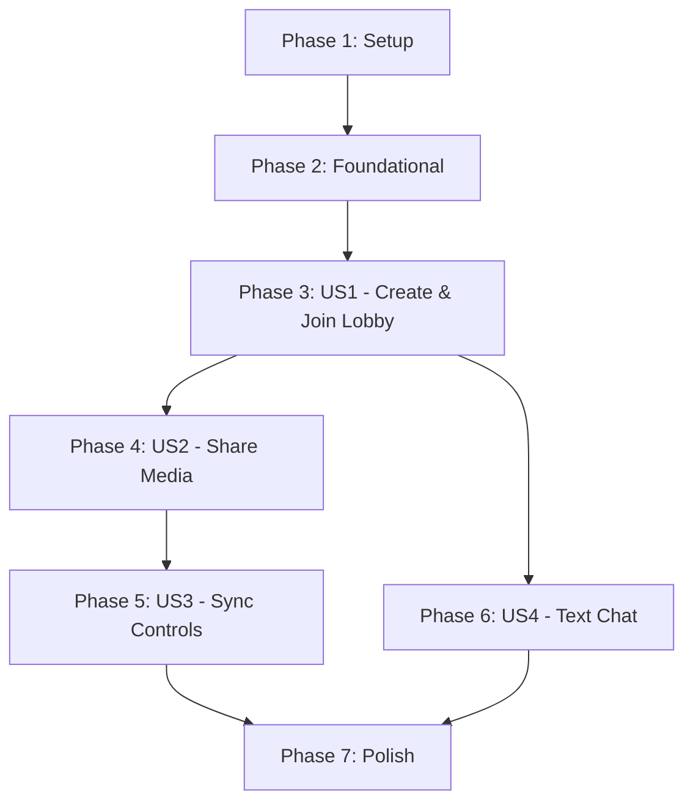

# Implementation Tasks: P2P Watch Together Streaming

**Feature**: 004-p2p-watch-together  
**Status**: Pending

## Phase 1: Setup
*Goal: Initialize the project structure and shared infrastructure.*

- [ ] T001 Initialize the Golang backend module in `services/monolith-stream-api/go.mod`
- [ ] T002 Add required Go dependencies (gorilla/websocket) to `services/monolith-stream-api/go.mod`
- [ ] T003 Initialize the Next.js frontend application in `apps/monolith-stream/package.json`
- [ ] T004 Add required frontend dependencies to `apps/monolith-stream/package.json`
- [ ] T005 Create the main Go entrypoint in `services/monolith-stream-api/main.go`

## Phase 2: Foundational
*Goal: Build the core signaling server and state management for WebRTC.*

- [x] T006 Implement the Lobby and Participant data models in `services/monolith-stream-api/models/lobby.go`
- [x] T007 Implement the core WebSocket connection handler in `services/monolith-stream-api/handlers/websocket.go`
- [x] T008 Implement the signaling message routing (join, offer, answer, ice_candidate) in `services/monolith-stream-api/handlers/websocket.go`
- [x] T009 Create the WebRTC Context and Provider in `apps/monolith-stream/src/hooks/useWebRTC.tsx`

## Phase 3: Create and Join a Lobby
*Goal: Allow users to generate a lobby and connect to it via WebSocket signaling.*
*Independent Test*: Can be fully tested by one user creating a lobby and another user joining via the provided link or scanning the QR code, successfully establishing a connection without any media streaming active.

- [x] T010 [US1] Create the Lobby creation UI (Home Page) in `apps/monolith-stream/src/app/page.tsx`
- [x] T011 [US1] Implement QR code generation and shareable link component in `apps/monolith-stream/src/components/ShareLobby.tsx`
- [x] T012 [P] [US1] Create the Lobby view page in `apps/monolith-stream/src/app/lobby/[id]/page.tsx`
- [x] T013 [US1] Implement the WebRTC connection negotiation (Offer/Answer/ICE) in `apps/monolith-stream/src/hooks/useWebRTC.tsx`
- [x] T014 [US1] Add a participant list component to display connected peers in `apps/monolith-stream/src/components/ParticipantList.tsx`

## Phase 4: Share Screen/Window or Local Video
*Goal: Allow users to broadcast media streams over WebRTC.*
*Independent Test*: Can be tested by having a user in a lobby start a stream (either screen share or local file) and verifying that the media (video and audio) is transmitted to other users in the same lobby.

- [x] T015 [P] [US2] Create the media selection UI (Screen Share vs Local File) in `apps/monolith-stream/src/components/StreamControls.tsx`
- [x] T016 [US2] Implement screen sharing capture logic in `apps/monolith-stream/src/hooks/useMediaStream.ts`
- [x] T017 [US2] Implement local video file selection and object URL generation in `apps/monolith-stream/src/hooks/useMediaStream.ts`
- [x] T018 [US2] Add the media stream track to the active `RTCPeerConnection`s in `apps/monolith-stream/src/hooks/useWebRTC.tsx`
- [x] T019 [US2] Create the Video Player component to render the active stream for all peers in `apps/monolith-stream/src/components/VideoPlayer.tsx`
- [x] T020 [US2] Handle stream termination and UI cleanup in `apps/monolith-stream/src/components/VideoPlayer.tsx`

## Phase 5: Synchronized Playback Controls for Video Files
*Goal: Ensure local video file playback is synchronized across all peers via RTCDataChannel.*
*Independent Test*: Can be tested by one user streaming a local video file and any participant attempting to pause or seek the video, verifying that the playback state updates simultaneously for all viewers.

- [x] T021 [US3] Establish a reliable `RTCDataChannel` for sync events during peer connection setup in `apps/monolith-stream/src/hooks/useWebRTC.tsx`
- [x] T022 [US3] Create synchronized playback controls UI (Play, Pause, Seek bar) in `apps/monolith-stream/src/components/SyncControls.tsx`
- [x] T023 [US3] Implement logic to broadcast `play`/`pause`/`seek` events over the data channel in `apps/monolith-stream/src/hooks/useWebRTC.tsx`
- [x] T024 [US3] Implement logic to receive and apply sync events to the local HTMLVideoElement in `apps/monolith-stream/src/components/VideoPlayer.tsx`
- [x] T025 [US3] Add conditional rendering to only show sync controls for local file streams in `apps/monolith-stream/src/components/VideoPlayer.tsx`

## Phase 6: Built-in Text Chat
*Goal: Provide a text-based chat using the RTCDataChannel.*
*Independent Test*: Can be tested by users sending text messages in the lobby chat and verifying that the messages appear in real-time for all other participants.

- [x] T026 [P] [US4] Create the Chat UI component (message list and input) in `apps/monolith-stream/src/components/Chat.tsx`
- [x] T027 [US4] Implement broadcasting text messages over the reliable `RTCDataChannel` in `apps/monolith-stream/src/hooks/useWebRTC.tsx`
- [x] T028 [US4] Implement receiving and appending chat messages to local state in `apps/monolith-stream/src/hooks/useWebRTC.tsx`

## Phase 7: Polish & Cross-Cutting Concerns
*Goal: Ensure robustness, error handling, and performance.*

- [x] T029 Implement seamless background reconnection logic for dropped WebRTC connections without disrupting active peers in `apps/monolith-stream/src/hooks/useWebRTC.tsx`
- [x] T030 Add error boundaries and fallback UI for signaling server connection failures in `apps/monolith-stream/src/app/lobby/[id]/page.tsx`
- [x] T031 Optimize React rendering to ensure `VideoPlayer.tsx` does not re-render when `Chat.tsx` receives new messages.

---

## Dependency Graph

## Parallel Execution Opportunities

- **US1 & Backend**: While the frontend developer builds the Lobby UI (T010, T011, T012), the backend developer can concurrently implement the Golang WebSocket handlers (T006, T007, T008).
- **US2 Media Capture & US4 Chat**: Once the foundational WebRTC connection (US1) is stable, a developer can build the chat UI (T026) independently of the complex media stream capture logic (T015, T016, T017).

## Implementation Strategy

1. **MVP**: Execute Phase 1 through Phase 3 (US1). This establishes the critical WebSocket signaling server and basic WebRTC peer connections.
2. **Increment 1**: Execute Phase 4 (US2). This delivers the primary value proposition: sharing a screen or local video.
3. **Increment 2**: Execute Phase 5 (US3). Adds synchronization capabilities.
4. **Increment 3**: Execute Phase 6 (US4) and Phase 7. Adds chat and hardens the application for release.